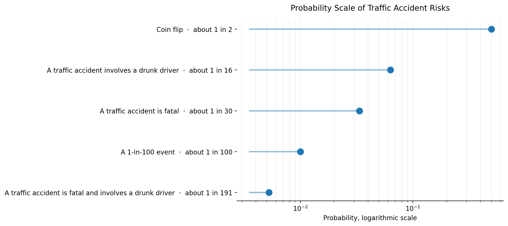

# Probability Scale of Traffic Accident Risks in Estonia

Most traffic risks in Estonia decreased by ~60% over the last two decades.

**However, drunk-driving accidents remain just as deadly when they occur.**

Test challenge submission for the RMK Data Team Internship 2026.

## Overview

This project uses open data from Statistics Estonia to build an interpretable probability scale for traffic accident risks in Estonia and compare how these risks changed over time.

Instead of showing probabilities in isolation, the project places related risks on a shared scale and compares two five-year periods:

- 2000–2004  
- 2020–2024

The goal is to make changes in risk intuitive and visible.

---

## Research Question

How have key traffic accident risks changed over time?

Specifically:

- How much has the share of drunk-driver accidents changed?
- How much has fatal accident risk changed?
- Has the fatality risk within drunk-driver accidents changed?
- How rare are fatal drunk-driver accidents overall?

---

## Data Source

Primary data source:

Statistics Estonia API  
Table TS093 — Inimkannatanutega liiklusõnnetused teedel

API endpoint:

https://andmed.stat.ee/api/v1/et/stat/TS093

Indicators used:

- Traffic accidents  
- Fatal traffic accidents  
- Traffic accidents involving a drunk driver  
- Fatal traffic accidents involving a drunk driver  

Data is fetched programmatically using Python.

---

## Method

For each 5-year period, probabilities are estimated using event frequencies:

### 1. Drunk-driver accident share

P(drunk accident) = drunk accidents / all accidents

### 2. Fatal accident risk

P(fatal accident) = fatal accidents / all accidents

### 3. Fatality risk within drunk-driver accidents

P(fatal | drunk accident) = fatal drunk-driver accidents / drunk-driver accidents

### 4. Fatal drunk-driver accident share

P(fatal and drunk) = fatal drunk-driver accidents / all accidents

These probabilities are plotted on a shared percentage scale.

---

## Results

The main pattern is clear:

Most traffic risks in Estonia decreased by around 60% between 2000–2004 and 2020–2024.

However, one risk did not meaningfully change:  
**the fatality risk within drunk-driving accidents.**

---

### What changed

Several major risk reductions are visible when comparing 2000–2004 to 2020–2024:

- **Drunk-driver accident share** fell from about 1 in 5 (~21%) to about 1 in 13 (~8%)  
  → ↓ ~63%

- **Fatal accident risk** fell from about 1 in 11 (~9%) to about 1 in 32 (~3%)  
  → ↓ ~64%

- **Fatal drunk-driver accident share** fell from about 1 in 45 (~2.2%) to about 1 in 127 (~0.8%)  
  → ↓ ~65%

These results indicate a substantial improvement in overall traffic safety and a reduction in alcohol-related accident involvement.

---

### What did *not* change

One result stands out:

- **Fatality risk within drunk-driver accidents** remained nearly unchanged  
  (about 1 in 9 → about 1 in 10)

This means:

> While drunk-driving accidents became much less common, their severity did not improve.

---

### Interpretation

The results suggest two distinct effects:

1. **Prevention improved**  
   Fewer accidents involve drunk drivers, and fewer accidents are fatal overall.

2. **Conditional risk remained high**  
   Given that a drunk-driving accident occurs, the probability that it is fatal has not meaningfully decreased.

In other words:

> Estonia reduced how often dangerous situations occur — but not how dangerous they are when they do occur.

---

## Example Output

Generated visualization comparing traffic accident risks across periods:



The figure shows:

- Drunk-driver accident share declined substantially  
- Overall fatal accident risk decreased strongly  
- Fatal drunk-driver accidents became much rarer  
- Fatality risk within drunk-driver accidents changed relatively little

---

## Repository Structure

```text
data/
├── raw/
│   └── ts093_traffic_accidents.csv

└── processed/
    └── probability_events.csv

src/
├── ingest_ts093.py
├── probabilities.py
└── plot.py

outputs/
└── probability_scale.png
```

---

## Run Instructions

Install dependencies:

```bash
pip install -r requirements.txt
```

Fetch source data:

```bash
python src/ingest_ts093.py
```

Calculate probabilities:

```bash
python src/probabilities.py
```

Generate visualization:

```bash
python src/plot.py
```

---

## Assumptions and Limitations

- Probabilities are estimated from aggregated frequencies.
- 5-year windows are used to reduce year-to-year noise.
- This is descriptive analysis, not causal inference.
- Results reflect recorded accident outcomes, not exposure risk.

Possible future extensions:

- Add confidence intervals
- Extend to additional time windows
- Compare effect sizes explicitly (risk ratios)
- Incorporate other public safety datasets

---

## Why This Approach

This solution prioritizes:

- reproducibility  
- transparent assumptions  
- interpretable probability communication  
- simple statistical reasoning  
- visual comparison of risk change over time
